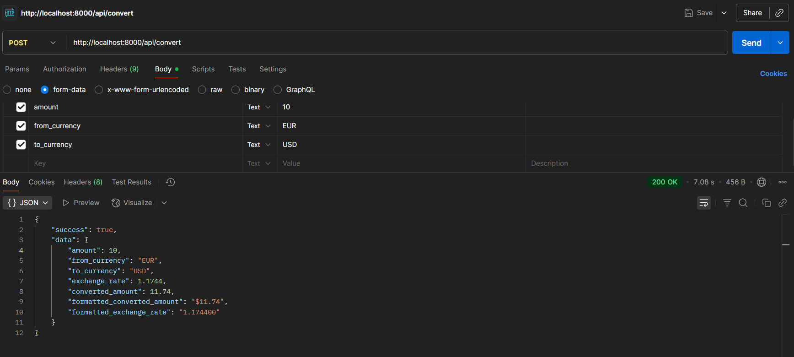
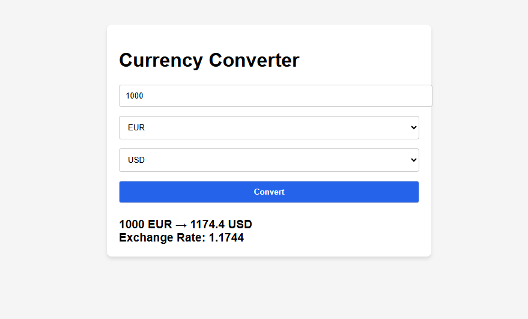
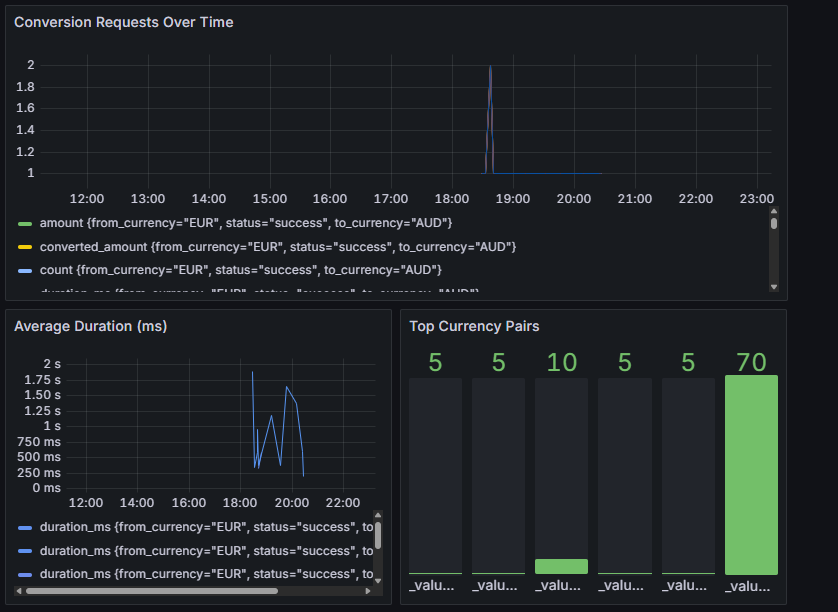

# Currency Converter Application

A production-ready currency conversion service built with Laravel, featuring real-time exchange rates, comprehensive monitoring, and a modern Vue.js frontend.

## 🚀 Features

### Core Functionality
- **Real-time Currency Conversion**: Leverages Swop.cx API for  exchange rates
- **Multi-currency Support**: Convert between major world currencies (USD, EUR, GBP, JPY, etc.)
- **Input Validation**: Robust validation for amounts and currency codes
- **Internationalization**: Formatted currency display using PHP's NumberFormatter

### Performance & Reliability
- **Redis Caching**: Exchange rates cached for 1 hour to optimize API calls
- **Retry Logic**: Automatic retry mechanism for failed API requests
- **Error Handling**: Comprehensive error handling with custom exceptions

### Monitoring & Analytics
- **InfluxDB Integration**: Real-time metrics collection for all conversions and API calls
- **Grafana Dashboard**: Visual monitoring of conversion rates, API response times, and error rates

### Security & Best Practices
- **Input Sanitization**: All inputs validated and sanitized
- **SOLID Principles**: Clean architecture with dependency injection
- **Interface Segregation**: Service contracts for easy testing and swapping

### Frontend Experience
- **Vue.js 3 Interface**: Modern, responsive user interface
- **Real-time Feedback**: Loading states and error handling

## Architecture

### Backend Structure
```
app/
├── Console/Commands/           # Artisan commands
│   └── CheckInfluxDBConnection.php
├── DataTransferObjects/        # Data transfer objects
│   └── CurrencyConversionResult.php
├── Exceptions/                 # Custom exceptions
│   └── CurrencyConversionException.php
├── Http/
│   ├── Controllers/           # API controllers
│   │   └── CurrencyConverterController.php
│   └── Requests/              # Form request validation
│       └── ConvertCurrencyRequest.php
├── Providers/                 # Service providers
│   ├── CurrencyServiceProvider.php
│   └── InfluxDBServiceProvider.php
└── Services/                  # Business logic
    ├── Contracts/
    │   └── CurrencyConverterInterface.php
    ├── InfluxDBService.php
    └── SwopCurrencyConverter.php
```

### Key Design Patterns
- **Dependency Injection**: Services injected through Laravel's IoC container
- **Repository Pattern**: Interface-based service layer for easy testing
- **Data Transfer Objects**: Structured data transfer with type safety
- **Service Layer**: Business logic separated from controllers

## Technology Stack

### Backend
- **PHP 8.4** - Modern PHP with strong typing
- **Laravel 12** - Latest Robust web application framework
- **Redis** - High-performance caching layer
- **InfluxDB 2.7** - Time-series database for metrics

### Frontend
- **Vue.js 3** - Progressive JavaScript framework
- **Composition API** - Modern Vue development approach
- **Axios** - HTTP client for API communication

### Infrastructure
- **Docker & Docker Compose** - Containerized deployment
- **Nginx** - High-performance web server
- **Grafana** - Analytics and monitoring dashboards

### External Services
- **Swop.cx API** - Real-time exchange rate provider

## Application Screenshots

### API Testing (Postman)

*Postman test showing successful EUR to USD conversion with formatted output*

### Vue.js Frontend

*Clean, responsive Vue.js interface for currency conversion*

### Grafana Monitoring Dashboard

*Real-time monitoring showing conversion requests, response times, and currency pair analytics*

##  Quick Start

### Prerequisites
- Docker & Docker Compose
- Git

### Installation

1. **Clone the repository**
```bash
git clone git clone https://github.com/MathewsJose/currency-converter.git
cd currency-converter
```

2. **Environment Setup**
```bash
cp .env.example .env
```

3. **Configure environment variables**
```env
# Swop API Configuration
SWOP_API_KEY=your_swop_api_key
SWOP_BASE_URL=https://swop.cx/rest

# InfluxDB Configuration
INFLUXDB_URL=http://influxdb:8086
INFLUXDB_TOKEN=currency_converter_token_123
INFLUXDB_BUCKET=currency_converter
INFLUXDB_ORG=currency-converter

# Redis Configuration
REDIS_HOST=redis
REDIS_PORT=6379
```

4. **Start the application**
```bash
docker-compose up -d
```

5. **Install dependencies**
```bash
docker-compose exec app composer install
docker-compose exec app php artisan key:generate
```

### Access Points
- **API**: http://localhost:8000
- **Frontend**: http://localhost:8080
- **Grafana Dashboard**: http://localhost:3000 (admin/admin123)
- **InfluxDB UI**: http://localhost:8086

##  API Reference

### Convert Currency
**POST** `/api/convert`

#### Request Body
```json
{
    "amount": 100.50,
    "from_currency": "USD",
    "to_currency": "EUR"
}
```

#### Response
```json
{
    "success": true,
    "data": {
        "amount": 100.50,
        "from_currency": "USD",
        "to_currency": "EUR",
        "exchange_rate": 0.850000,
        "converted_amount": 85.43,
        "formatted_converted_amount": "€85.43",
        "formatted_exchange_rate": "0.850000"
    }
}
```

#### Error Response
```json
{
    "success": false,
    "message": "Validation errors",
    "errors": {
        "amount": ["Amount must be at least 0.01"]
    }
}
```

### Validation Rules
- **amount**: Required, numeric, minimum 0.01
- **from_currency**: Required, 3 uppercase letters (e.g., USD)
- **to_currency**: Required, 3 uppercase letters, different from from_currency

##  Testing

### Run Tests
```bash
docker-compose exec app php artisan test
```

### Test Coverage
- **Feature Tests**: API endpoint validation and response structure
- **Unit Tests**: Service layer business logic

### Health Checks
```bash
# Check InfluxDB connection
docker-compose exec app php artisan influxdb:check
```

##  Monitoring & Analytics

### Metrics Collected
- **Conversion Metrics**: Success/failure rates, response times
- **API Metrics**: External API call performance and errors
- **Business Metrics**: Popular currency pairs, conversion volumes

### Grafana Dashboards
Access Grafana at http://localhost:3000 to view:
- Real-time conversion statistics
- API performance metrics
- Error rate monitoring
- Currency pair popularity

### InfluxDB Measurements
- `currency_conversion`: Conversion request metrics
- `exchange_rate_api`: External API call metrics

##  Configuration

### Cache Configuration
- **TTL**: 3600 seconds (1 hour) for exchange rates
- **Driver**: Redis for high performance
- **Invalidation**: Automatic based on TTL

##  Development

### Code Standards
- **SOLID** principles implementation
- **Clean Architecture** patterns
- **Type Declarations** throughout

### Architecture Highlights
- **Interface Segregation**: CurrencyConverterInterface
- **Dependency Injection**: Service container usage
- **Single Responsibility**: Focused service classes
- **Open/Closed Principle**: Extensible through interfaces
